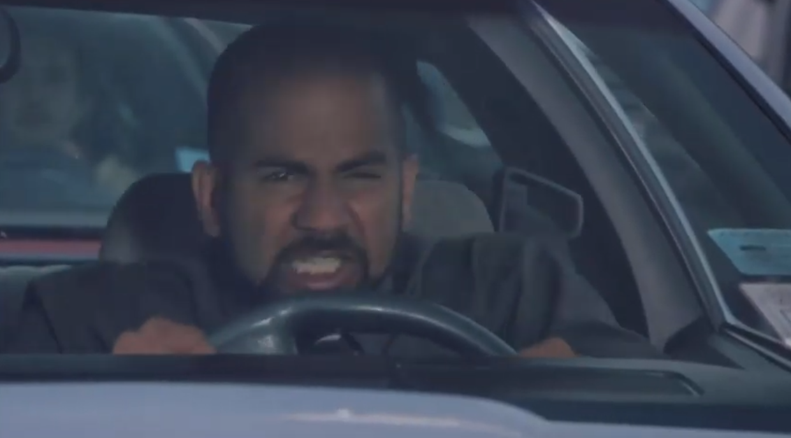
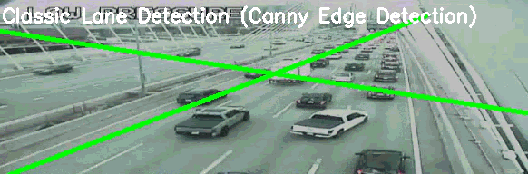
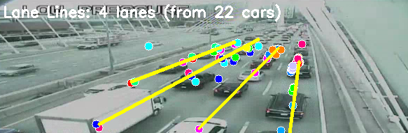
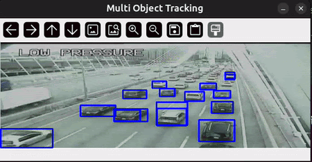
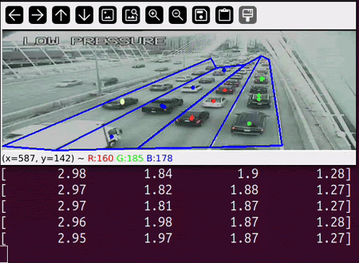
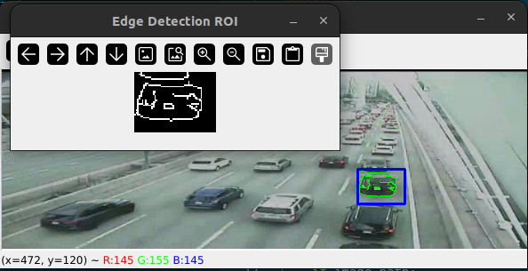
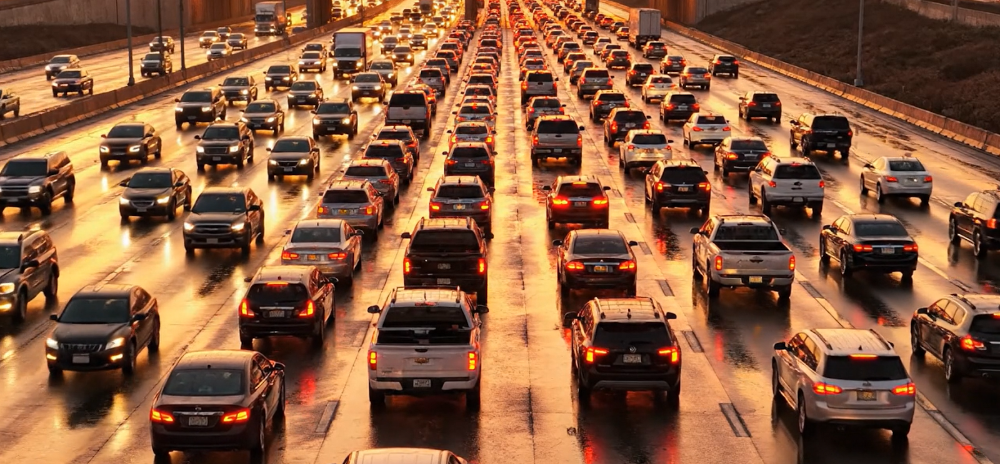
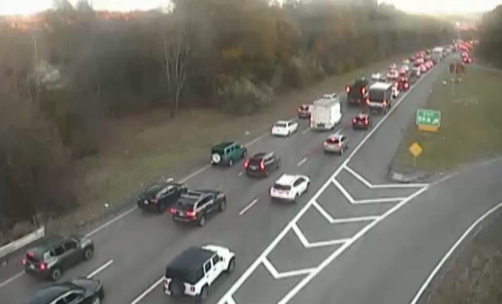

# Traffic Lane Optimizer

Dhvan Shah, Dan Khoi Nguyen, David Barsoum
Computational Robotics | Fall 2025

Figure 1: The opening scene of *Office Space (1999)*, depicting the frustrating emotions that arise from stop and go traffic.

---

# Project Goal

The goal of this project was to apply our robotics knowledge to learn and complete a machine vision project. For our specific project, our team decided that we wanted to create a system that optimizes the travel of cars in heavy stop-and-go traffic.

Every driver has been stuck in stop and go traffic before–and they have all felt the same experience. You are driving in your lane and it stops. You notice the lane next to you is moving, so you switch to that lane. But it seems to never fail–every time you switch to the moving lane, it suddenly stops and the lane you had just left becomes the best lane.

Our system aims to utilize a camera on a car or other well-viewing area to determine which lane is the fastest moving, and provide instructions to a specific car on when to switch to a new lane, such that the car is always in a moving lane.

---

# Methodology

## Lane Detection

### Approach #1: Classical Edge-Based Lane Detection

Our first attempt used traditional computer vision primitives: Canny edge detection for boundary extraction, and Hough line detection to identify linear features. However, this approach failed in practice because Canny responded strongly to all high-contrast boundaries, including: Guard rails and Jersey barriers, The breakdown lane/shoulder markings, Shadows and texture edges, Artifacts in the video caused by compression

This resulted in an over-detection of "edges" that were not lane markers, making meaningful lane inference unreliable. Additional filtering heuristics (angle filtering, histogram thresholds, ROI constraints) were insufficient because the scene contained multiple valid parallel linear structures that were indistinguishable to edge-based methods.

Figure 2: An attempt at using Canny edge detection to detect traffic lanes.

### Motion-Based Lane Estimation

Our second approach aimed to solve the issue of poor lane detection by utilizing the average motion of the cars to determine the major lanes.

Our overall approach is to collect location data for a set of cars over time, fit a line of best fit to these points, to get the overall direction, and filter out all lines to obtain lines for our lanes.

**Collect Data**

1. Track every vehicle visible in the first ~3 seconds of the video.
2. Tracking is done without semantic object recognition; rather association is distance-based and frame-to-frame consistent with physical motion constraints.
    1. We chose to use a distance based method after we tried using semantic object recognition from the Yolo Library, but found it too laggy.
3. Every second, record the centroid position of each tracked vehicle.

**Determine Possible Lanes**

1. For each tracked vehicle, we fit a linear regression line (least-squares line of best fit).
    1. this yields one estimated lane-direction vector per vehicle: $\mathbf{v}$.

**Filter to Correct Lanes**

1. Each trajectory line is represented with slope intercept form.
2. We cluster these lines to find the major lane locations.
    1. We use **DBSCAN**, which is a clustering algorithm.
3. Select the longest N lines (where N is the number of lanes).
    1. This step is important because with clustering more than N lines can occur.

This approach overcomes almost all classic lane detection failure modes. It works even when lane markings are missing, and adapts to cars obstructing the lane.

Figure 3: Lane detection by using motion of the cars to determine lanes.

## Car Detection

Our system employs a high-performance, hybrid "**detect-then-track**" methodology to monitor vehicles. This approach balances the accuracy of deep learning with the speed of classical computer vision.

For initial, robust object detection, we use a pre-trained **YOLO (You Only Look Once)** model ($\text{yolo11n.pt}$). This model is lightweight and optimized to run efficiently on a GPU. Instead of running this computationally intensive model on every single frame, we run it periodically (every 5 frames) to get a fresh, accurate snapshot of all cars in the scene.

In the intermediate frames between YOLO detections, we use faster trackers to follow the cars. For each car detected by YOLO, we initialize an **OpenCV MIL (Multiple Instance Learning) tracker**. These trackers are much faster than the YOLO model and are responsible for predicting the car's new bounding box in the next frame. To update all active trackers simultaneously, we use a **ThreadPoolExecutor**. This parallel processing allows us to handle many cars on screen without a significant drop in frame rate. Every 5 frames, the list of trackers is cleared, and a new set is created from the fresh YOLO detection, which corrects for any drift and detects new cars entering the scene.

This hybrid strategy provides the high accuracy of a deep learning detector while maintaining the high-speed performance required for real-time video analysis.

Figure 4: Multi car detection with hybrid YOLO and OpenCV trackers

## Lane Speed

Calculating the speed of each lane involves three main steps: lane definition, car-to-lane association, and speed aggregation.

Before processing the video, the system requires a one-time setup where the user manually defines the lanes by drawing lane lines on the first frame that define the polygons for each lane. (If we had more time we would implement the auto lane detection discussed above.) These lane polygons serve as the Regions of Interest for each lane. In each frame, we get the center coordinate of every tracked car. We use OpenCV's *cv2.pointPolygonTest* function to determine which lane polygon the car's center is currently inside. Each car is then tagged with the ID of the lane it occupies. To calculate speed, we compare each car's position in the current frame to its position in the previous frame.

We first re-associate cars frame-to-frame by finding the nearest neighbor in the same lane. This ensures we are measuring the continuous movement of a single car, not jumping between different cars. An individual car's speed is calculated as the change in its vertical (**Y-axis**) pixel position ($\Delta y$) between the two frames. Since the traffic is moving vertically in the video, this vertical pixel displacement is a reliable proxy for its relative forward speed. All individual speed measurements for every car in a specific lane are collected. The final **LaneSpeed** displayed is the running average of all these individual measurements, providing a stable value to compare which lane is moving fastest over time.

Figure 5: Lane speed calculation

## Canny Edge Detection

Despite not being referenced in the MVP for this project, one thing we worked on was the Canny Edge Detection and tracking of the car. The code begins by loading a video provided. The user then has the option to manually select a Region of Interest around the car in the first frame, which defines the initial bounding box for tracking. We then initialize an OpenCV MIL tracker to follow the car across frames, updating the bounding box in each frame. Within the tracked ROI, the code applies Canny edge detection, first converting the ROI to grayscale, then blurring it to reduce noise, and finally detecting edges. The resulting edges are overlaid on the original frame or image in green, while the bounding box is drawn in blue. The program displays both the full frame with the highlighted car and the isolated edge-detected ROI.

Figure 6: Canny Edge Detection, outlining and tracking one vehicle

---

# Challenges

Throughout this project, many of the challenges we faced dealt with finding and utilizing a good "data set". In the context of this project, this would be the videos we would be using, the videos to be analyzed. These videos would need to provide a clear depiction of stop and go traffic on a multi lane highway. We thought this would be simple and easy to find on the internet but for a multitude of reasons this was not the case.

One issue was that most of the stock videos available online were of normal highways, normal driving speeds, and normal times. This was not ideal data for us because we needed videos of heavy traffic from a top down angle. We realized that it would not make sense for there to be stock footage of this because there is simply no market for that. Traffic videos don't exist and to get the best angle for us would require either a drone or a very high placed camera. Therefore our next approach was to get the videos ourselves, however we found out flying drones above cars is illegal and the angle we needed was impossible to achieve otherwise. This led us to try to create **AI generated videos** to use as data. The issue with this was simply that AI generated videos were not reliable. Cars would move in weird ways and it was not a good representation of real traffic.

Figure 7: A screenshot of an AI generated video of traffic we attempted to use for our model, generated with Google Veo 3.

This led us to pivot to using **MassDOT highway live cams**. An idea we had was to pipe the live stream video into our code to use and view live, but this was impossible because traffic conditions were not always bad and pulling the live stream proved to be out of scope. We instead screen recorded videos of the road during heavy traffic times and used that as our dataset.

Figure 8: Highway camera footage of Route 9 in Westborough MA, which we used to test our model.

---

# Future Work

In the future, if given more time, we would definitely like to expand this project to be usable **in real time** rather than as an analysis of past data sets. In other words, we are able to drive ourselves and using this algorithm track our car, determine the best lane surrounding the car, and to switch to it. To do this, we would need to first implement a way of attaching a camera to the car or by switching through MassDOT feeds to follow the car. This would allow us to be able to track and analyze our own vehicle, to better maneuver ourselves.

Another implementation we would need to develop would be creating an algorithm that **automatically detects the lanes** using computer vision. As of now, lanes are hardcoded or defined by hand. If we could analyze given footage and detect and create bounding boxes around lanes we could then dynamically track the car and measure its surroundings. Some approaches we have brainstormed are by basing it off of the lines on the highway or by binding cars moving together in the same direction. We would also like to better flesh out the **Canny Edge detection** to better track the cars. We feel this would make the tracking more accurate and robust.

---

# Lessons Learned

From this project, we learned many things about computer vision, our approach, and its limitations. One thing that stood out to us is how important it is to choose the **right dataset**, because everything builds off of the data. We also figured out that working with **real time video analysis** was much harder than we expected, and it taught us about the challenges of handling lots of information quickly and constantly. Using tools like **YOLO and OpenCV** showed us how powerful computer vision can be for detecting and tracking objects. It was interesting for us to see how robust and useful existing frameworks from OpenCV were. We also realized there are many ways to approach a project like this, each leading to different insights and results. We recognized that using real world data and having that real world impact was really meaningful and worthwhile for us. Overall, this project gave us a better understanding of how computer vision works in the real world, the importance of planning and scaffolding the project carefully, and how even small changes in approach can make a big difference.
